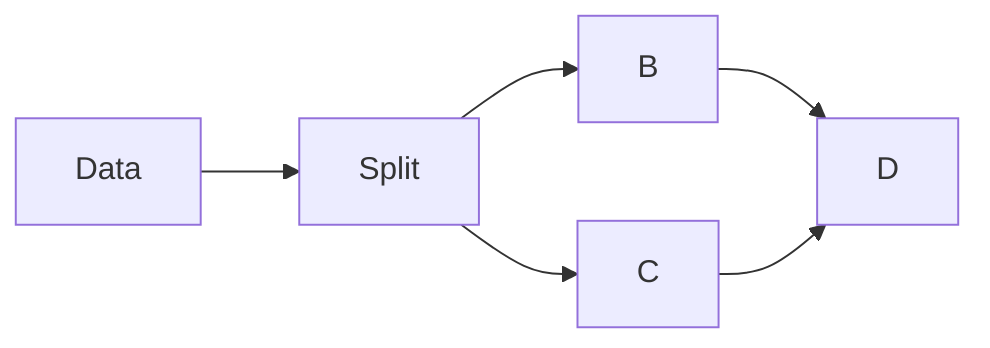

# git_tutorial
Github tutorial

<!-- - - - - - - - - - - - - - - - - - - - About the project section -->
# Project
## What
The __goal__ of the project was...

## Why
**This text is _extremely_ ~~strange~~ important**

## How

### Math inline
Sups and Subs:
dist<sub>c</sub> = dist<sub>a</sub><sup>2</sup> - dist<sub>b</sub><sup>2</sup>

Math inline:
$\sqrt{3x=1}+(1+x)^2$

Use `git status` to list all new or modified files that haven't yet been committed.

Some basic Git commands are:
```
git status
git add
git commit
```

## Tables
| Command | Description |
| --- | --- |
| `git status` | List all *new or modified* files |
| `git diff` | Show file differences that **haven't been** staged |


```ruby
require 'redcarpet'
markdown = Redcarpet.new("Hello World!")
puts markdown.to_html
```

<!-- - - - - - - - - - - - - - - - - - - - Charts -->
## Charts
Simple pipeline:


## Colors
The accent color is `#0969DA`, for light mode and `rgb(9, 50, 218)` for dark mode.

## Quotes
Quoting Noam Chomsky:
> Language is a process of free creation; its laws and principles are fixed, but the manner in which the principles of generation are used is free and infinitely varied. Even the interpretation and use of words involves a process of free creation.

## Alerts
> [!NOTE]
> Highlights information that users should take into account, even when skimming.

> [!IMPORTANT]
> Crucial information necessary for users to succeed.

> [!WARNING]
> Critical content demanding immediate user attention due to potential risks.

## Linking
This site was built using [GitHub Pages](https://pages.github.com/).

# ⚜️ Collabolators
This project was created as a team effort of following persons:
- John Doe
- Stan Smith
- Joanna Kovalski

# ⚜ License / Footnotes / Additional Info

Here is a simple footnote[^1].

A footnote can also have multiple lines[^2].

[^1]: My reference.
[^2]: To add line breaks within a footnote, prefix new lines with 2 spaces.
  This is a second line.
